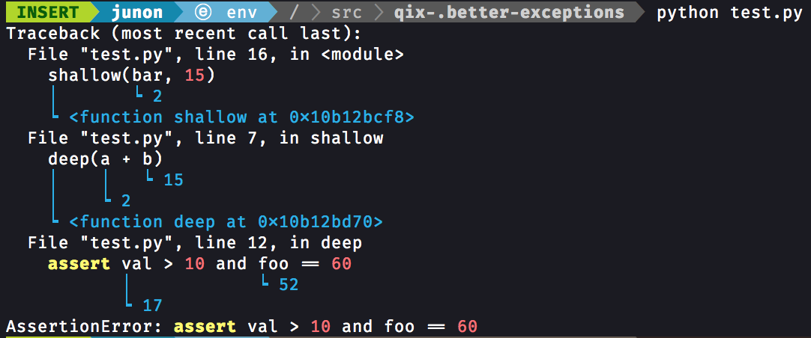

# better-exceptions [](https://travis-ci.org/Qix-/better-exceptions)

Pretty and more helpful exceptions in Python, automatically.



## Usage

Install `better_exceptions` via pip:

```console
$ pip install better_exceptions
```

And set the `BETTER_EXCEPTIONS` environment variable to any value:

```bash
export BETTER_EXCEPTIONS=1  # Linux / OSX
setx BETTER_EXCEPTIONS 1    # Windows
```

That's it!

### Python REPL (Interactive Shell)

In order to use `better_exceptions` in the Python REPL, first install the package (as instructed above) and run:

```console
$ python -m better_exceptions
Type "help", "copyright", "credits" or "license" for more information.
(BetterExceptionsConsole)
>>>
```

in order to drop into a `better_exceptions`-enabled Python interactive shell.

### Advanced Usage

If you want to allow the entirety of values to be outputted instead of being truncated to a certain amount of characters:

```python
import better_exceptions
better_exceptions.MAX_LENGTH = None
```

While using `better_exceptions` in production, do not forget to unset the `BETTER_EXCEPTIONS` variable to avoid leaking sensitive data in your logs.

### Use with unittest

If you want to use `better_exceptions` to format `unittest`'s exception output, you can use the monkey patch below:

```python
import sys
import unittest
import better_exceptions

def patch(self, err, test):
    lines = better_exceptions.format_exception(*err)
    if sys.version_info[0] == 2:
        return u"".join(lines).encode("utf-8")
    return "".join(lines)

unittest.result.TestResult._exc_info_to_string = patch
```

Note that this uses an undocumented method override, so it is **not** guaranteed to work on all platforms or versions of Python.

### Django Usage

In `settings.py`, add your new class to the `INSTALLED_APPS` and `MIDDLEWARE` lists:

```python
# ...
INSTALLED_APPS = [
    # ...
    "better_exceptions",
]
# ...
MIDDLEWARE = [
    # ...
    "better_exceptions.integrations.django.BetterExceptionsMiddleware",
]
# ...
```

example output:


## Troubleshooting

If you do not see beautiful exceptions, first make sure that the environment variable does exist. You can try `echo $BETTER_EXCEPTIONS` (Linux / OSX) or `echo %BETTER_EXCEPTIONS%` (Windows). On Linux and OSX, the `export` command does not add the variable permanently, you will probably need to edit the `~/.profile` file to make it persistent. On Windows, you need to open a new terminal after the `setx` command.

Check that there is no conflict with another library, and that the `sys.excepthook` function has been correctly replaced with the `better_exceptions`'s one. Sometimes other components can set up their own exception handlers, such as the `python3-apport` Ubuntu package that you may need to uninstall.

Make sure that you have not inadvertently deleted the `better_exceptions_hook.pth` file that should be in the same place as the `better_exceptions` folder where all of your Python packages are installed. Otherwise, try re-installing `better_exceptions`.

You can also try to manually activate the hook by adding `import better_exceptions; better_exceptions.hook()` at the beginning of your script.

Finally, if you still can not get this module to work, [open a new issue](https://github.com/Qix-/better-exceptions/issues/new) by describing your problem precisely and detailing your configuration (Python and `better_exceptions` versions, OS, code snippet, interpeter, etc.) so that we can reproduce the bug you are experiencing.

# License
Copyright &copy; 2017, Josh Junon. Licensed under the [MIT license](LICENSE.txt).
